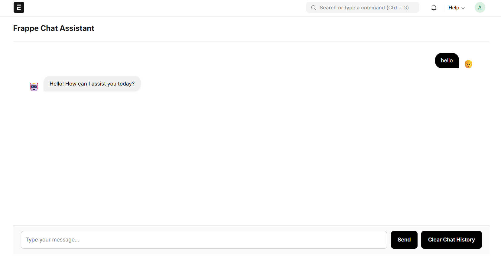
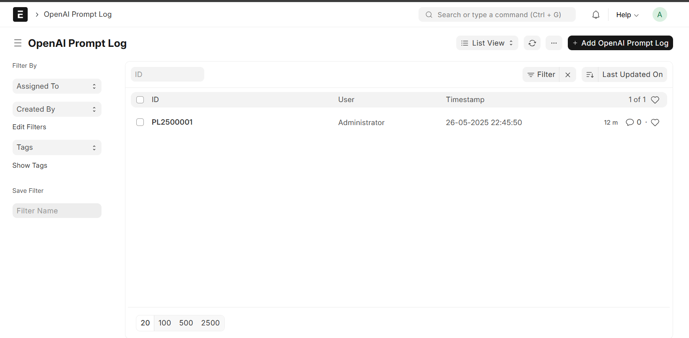
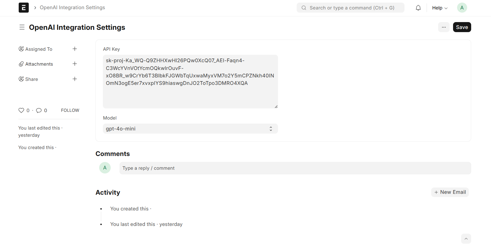
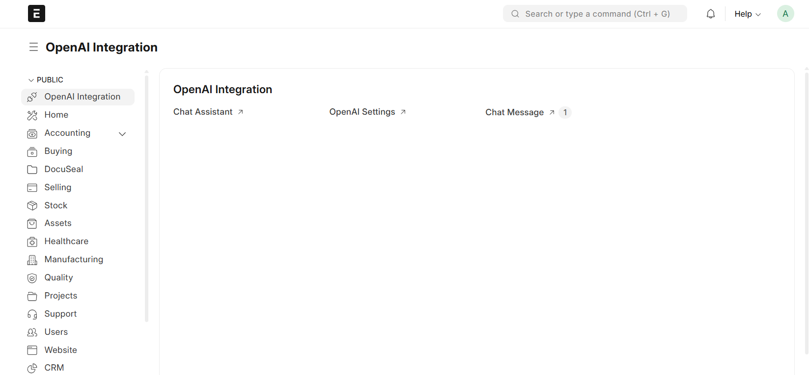

# 🧠 OpenAI Integration for Frappe

A powerful custom Frappe app that integrates OpenAI’s models (like ChatGPT) into your ERP system. This tool enables users to interact with OpenAI APIs directly from the Frappe interface, submit prompts, and view generated responses with a seamless, user-friendly UI.

---

## 🌟 Features

- ✍️ Prompt Submission Interface (Chat-style)
- 📬 View AI-generated responses in real-time
- 🧾 Prompt history tracking
- ⚙️ OpenAI API Key Configuration
- 📊 Dashboard showing prompt stats (total prompts, settings, etc.)
- 🔐 Role-based access control for using AI features
- 💬 Multi-message threads or single prompts

---

## 🖼️ UI Screenshots

1. **Prompt Input Interface**

   - Input your question to OpenAI
   - Get immediate response via API
   - Save history for reference

2. **Prompt History Listing**

   - View all past queries and responses
   - Filter by user/date/type

3. **OpenAI Settings**

   - Configure API keys
   - Toggle model options (e.g., `gpt-3.5`, `gpt-4`)

4. **Dashboard**

   - Shows:
     - OpenAI Settings
     - Total prompts
     - Chat Assistant

---

## 🛠️ Installation

Make sure you have Frappe set up.

```bash
# Get the app
$ bench get-app https://github.com/manavmandli/frappe_openai_integration.git

# Install on your site
$ bench --site yoursite install-app frappe_openai_integration

